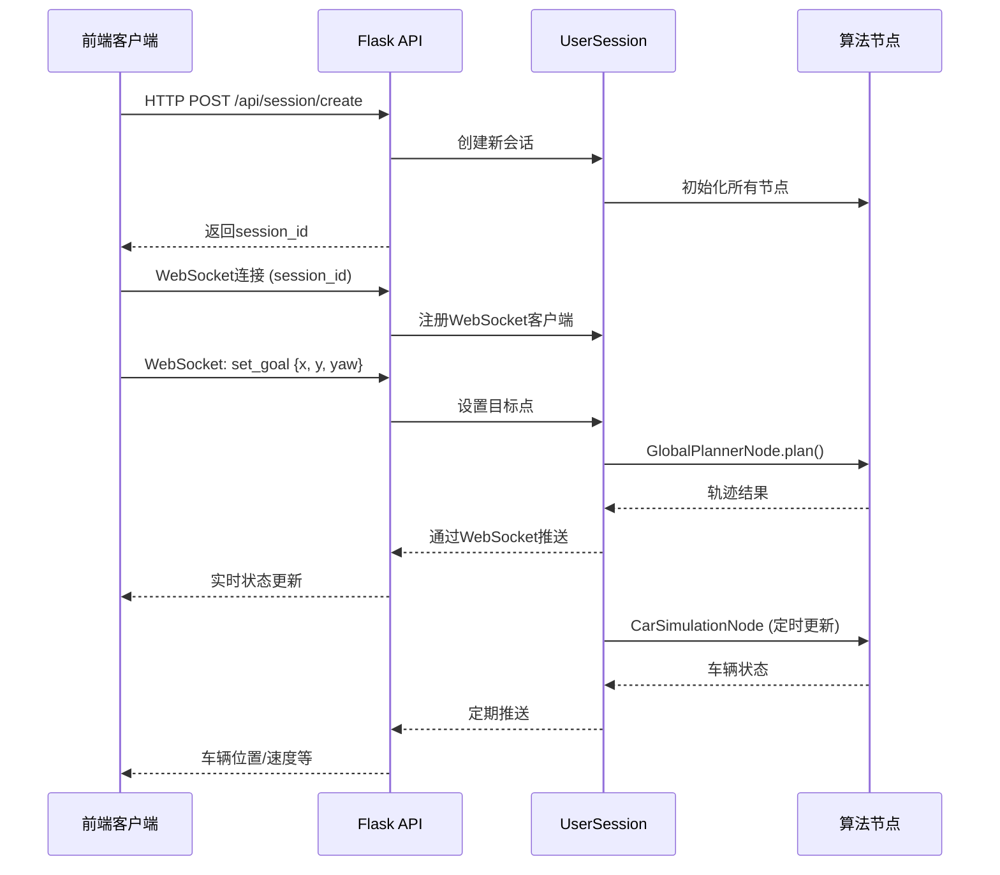

# Autonomous Vehicle API改造计划

## 一、架构设计概览

### 1.1 当前架构 vs 目标架构

**当前架构（Qt桌面应用）：**

```
MainWindow (Qt GUI)
  ├─ MapServerNode (Qt Signal/Slot)
  ├─ CarSimulationNode (Qt Timer)
  ├─ GlobalPlannerNode (多进程)
  ├─ LocalPlannerNode (多进程)
  └─ TrajectoryCollisionCheckingNode
```

**目标架构（Flask Web API）：**

```
Flask App
  ├─ RESTful API (HTTP)
  ├─ WebSocket Server (实时通信)
  └─ SimulationManager (管理多个用户会话)
      └─ UserSession (每个用户一个独立实例)
          ├─ MapServerNode (无Qt依赖)
          ├─ CarSimulationNode (Threading替代Qt Timer)
          ├─ GlobalPlannerNode (保持多进程)
          ├─ LocalPlannerNode (保持多进程)
          └─ TrajectoryCollisionCheckingNode
```

### 1.2 数据流设计



## 二、项目结构设计

### 2.1 新增目录结构

```
Autonomous-Vehicle-Remake/
├── AutonomousVehicle/          # 算法核心（保持不变）
│   ├── modeling/
│   ├── global_planner/
│   ├── local_planner/
│   └── ...
├── api/                        # 新增：Flask API层
│   ├── __init__.py
│   ├── app.py                  # Flask应用主入口
│   ├── config.py               # 配置文件（开发/生产环境）
│   ├── routes.py               # RESTful API路由
│   ├── websocket_handlers.py   # WebSocket事件处理
│   ├── simulation_manager.py   # 会话管理器（多用户支持）
│   ├── session.py              # 单个用户会话类
│   └── utils.py                # 工具函数（序列化等）
├── api/adapters/               # 新增：适配器层（移除Qt依赖）
│   ├── __init__.py
│   ├── car_simulation.py       # CarSimulationNode的无Qt版本
│   ├── map_server.py           # MapServerNode的无Qt版本
│   └── event_bus.py            # 事件总线（替代Qt Signal/Slot）
├── requirements.txt            # 添加Flask相关依赖
├── requirements-api.txt        # 仅API相关依赖（可选）
├── Dockerfile                  # Docker部署配置
├── docker-compose.yml          # 本地Docker开发
├── .env.example               # 环境变量模板
├── run_api.py                 # 本地开发启动脚本
└── gunicorn_config.py         # Gunicorn配置（生产环境）
```

## 三、核心实现步骤

### 3.1 阶段一：创建基础API框架

**目标：** 搭建Flask应用骨架，实现基本的HTTP接口

**文件：** `api/app.py`

- 创建Flask应用实例
- 配置CORS（允许前端跨域访问）
- 注册蓝图（routes）
- 初始化Flask-SocketIO

**文件：** `api/config.py`

- 开发环境配置（DEBUG=True, 端口5000）
- 生产环境配置（从环境变量读取）
- CORS允许的域名列表
- WebSocket配置

**文件：** `api/routes.py`

- `GET /api/health` - 健康检查
- `POST /api/session/create` - 创建新会话
- `GET /api/session/{session_id}/status` - 查询会话状态
- `DELETE /api/session/{session_id}` - 删除会话

**教学要点：**

- 解释Flask应用工厂模式
- CORS的作用和配置方法
- RESTful API设计原则

### 3.2 阶段二：实现事件总线（替代Qt Signal/Slot）

**目标：** 创建一个简单的事件系统，替代Qt的Signal/Slot机制

**文件：** `api/adapters/event_bus.py`

```python
# 简单的事件发布-订阅系统
class EventBus:
    def __init__(self):
        self._subscribers = {}
    
    def subscribe(self, event_type, callback):
        # 订阅事件
    
    def emit(self, event_type, *args, **kwargs):
        # 发布事件
```

**教学要点：**

- 观察者模式的应用
- 如何解耦组件间的通信
- 与Qt Signal/Slot的对比

### 3.3 阶段三：创建无Qt依赖的节点适配器

**目标：** 将依赖Qt的节点改为纯Python实现

**文件：** `api/adapters/car_simulation.py`

- 将`CarSimulationNode`从继承`QObject`改为普通类
- 使用`threading.Timer`替代`QTimer`
- 使用事件总线替代`Signal.emit()`

**关键改动：**

```python
# 原代码（Qt版本）
class CarSimulationNode(QObject):
    measured_state = Signal(float, Car)
    def timerEvent(self, event):
        # Qt Timer事件

# 新代码（无Qt版本）
class CarSimulationAdapter:
    def __init__(self, event_bus):
        self._event_bus = event_bus
        self._timer = threading.Timer(...)
    
    def _publish_state(self):
        self._event_bus.emit('measured_state', timestamp, car)
```

**文件：** `api/adapters/map_server.py`

- 同样移除Qt依赖，使用事件总线

**教学要点：**

- 如何识别和移除框架依赖
- 定时器的替代方案
- 保持算法逻辑不变

### 3.4 阶段四：实现用户会话管理

**目标：** 支持多用户，每个用户独立的仿真实例

**文件：** `api/session.py`

```python
class UserSession:
    def __init__(self, session_id):
        self.session_id = session_id
        self.event_bus = EventBus()
        # 初始化所有节点（无Qt版本）
        self.map_server = MapServerAdapter(self.event_bus)
        self.car_sim = CarSimulationAdapter(self.event_bus)
        self.global_planner = GlobalPlannerNode(...)  # 保持原样
        self.local_planner = LocalPlannerNode(...)    # 保持原样
        # 连接事件总线
        self._setup_event_handlers()
    
    def set_goal(self, x, y, yaw):
        # 设置目标点
    
    def set_state(self, x, y, yaw):
        # 设置车辆初始状态
    
    def get_state(self):
        # 获取当前状态（用于HTTP查询）
```

**文件：** `api/simulation_manager.py`

```python
class SimulationManager:
    def __init__(self):
        self._sessions = {}  # {session_id: UserSession}
        self._lock = threading.Lock()
    
    def create_session(self) -> str:
        # 创建新会话，返回session_id
    
    def get_session(self, session_id: str) -> UserSession:
        # 获取会话（线程安全）
    
    def delete_session(self, session_id: str):
        # 清理会话资源
```

**教学要点：**

- 单例模式的应用
- 线程安全（Lock的使用）
- 资源管理（会话清理）

### 3.5 阶段五：实现WebSocket实时通信

**目标：** 通过WebSocket推送实时状态更新

**文件：** `api/websocket_handlers.py`

```python
@socketio.on('connect')
def handle_connect(auth):
    # 验证session_id，注册WebSocket连接

@socketio.on('disconnect')
def handle_disconnect():
    # 清理连接

@socketio.on('set_goal')
def handle_set_goal(data):
    # 处理设置目标点请求

@socketio.on('set_state')
def handle_set_state(data):
    # 处理设置车辆状态请求

@socketio.on('brake')
def handle_brake():
    # 处理刹车请求
```

**在`UserSession`中添加WebSocket推送：**

```python
class UserSession:
    def __init__(self, session_id, socketio):
        self._socketio = socketio
        # 订阅事件，推送到WebSocket
        self.event_bus.subscribe('measured_state', self._on_state_update)
    
    def _on_state_update(self, timestamp, car):
        # 序列化数据并推送
        self._socketio.emit('state_update', {
            'timestamp': timestamp,
            'car': self._serialize_car(car)
        }, room=self.session_id)
```

**教学要点：**

- WebSocket vs HTTP的区别
- 房间（room）的概念（多用户隔离）
- 数据序列化（numpy数组转JSON）

### 3.6 阶段六：数据序列化工具

**目标：** 处理numpy数组和自定义对象的JSON序列化

**文件：** `api/utils.py`

```python
def serialize_car(car: Car) -> dict:
    # Car对象转字典

def serialize_trajectory(trajectory: np.ndarray) -> list:
    # numpy数组转列表

class NumpyEncoder(json.JSONEncoder):
    # 自定义JSON编码器
```

**教学要点：**

- JSON序列化的限制
- 自定义编码器的实现

### 3.7 阶段七：本地开发配置

**文件：** `run_api.py`

```python
#!/usr/bin/env python3
"""本地开发启动脚本"""
from api.app import create_app, socketio
import os

if __name__ == '__main__':
    app = create_app('development')
    port = int(os.getenv('PORT', 5000))
    socketio.run(app, host='0.0.0.0', port=port, debug=True)
```

**文件：** `.env.example`

```
FLASK_ENV=development
PORT=5000
ALLOWED_ORIGINS=http://localhost:3000,http://localhost:5173
```

**教学要点：**

- 环境变量的使用
- 开发模式vs生产模式

### 3.8 阶段八：Docker部署配置

**文件：** `Dockerfile`

```dockerfile
FROM python:3.12-slim

WORKDIR /app

# 安装系统依赖
RUN apt-get update && apt-get install -y \
    gcc g++ \
    && rm -rf /var/lib/apt/lists/*

# 复制依赖文件
COPY requirements.txt .
RUN pip install --no-cache-dir -r requirements.txt

# 复制应用代码
COPY . .

# 暴露端口
EXPOSE 5000

# 启动命令
CMD ["gunicorn", "--worker-class", "eventlet", "-w", "1", "--bind", "0.0.0.0:5000", "api.app:app"]
```

**文件：** `docker-compose.yml`（本地开发）

```yaml
version: '3.8'
services:
  api:
    build: .
    ports:
      - "5000:5000"
    environment:
      - FLASK_ENV=development
    volumes:
      - .:/app
```

**文件：** `gunicorn_config.py`

```python
# Gunicorn生产配置
workers = 1
worker_class = "eventlet"
bind = "0.0.0.0:5000"
timeout = 120
```

**教学要点：**

- Docker基础概念
- 多阶段构建（可选优化）
- 生产环境配置

### 3.9 阶段九：AWS EC2部署指南

**部署步骤文档：** `docs/deployment.md`

1. EC2实例选择（推荐t3.medium或更高）
2. 安全组配置（开放5000端口）
3. Docker安装
4. 应用部署
5. Nginx反向代理（可选）
6. 域名配置（可选）

**教学要点：**

- 云服务器基础
- 安全组配置
- 服务持久化运行

## 四、关键技术点详解

### 4.1 Qt Timer → Threading Timer

**原代码：**

```python
self._timer_id = self.startTimer(interval_ms, Qt.TimerType.PreciseTimer)
```

**新代码：**

```python
def _start_timer(self):
    self._timer = threading.Timer(self._interval, self._callback)
    self._timer.daemon = True
    self._timer.start()
```

### 4.2 Signal/Slot → 事件总线

**原代码：**

```python
self.signal.emit(data)
# 连接
self.signal.connect(callback)
```

**新代码：**

```python
self.event_bus.emit('event_name', data)
# 订阅
self.event_bus.subscribe('event_name', callback)
```

### 4.3 多进程保持

`GlobalPlannerNode`和`LocalPlannerNode`使用多进程避免GIL，这部分保持不变，只需移除Qt依赖。

## 五、测试策略

### 5.1 单元测试

- 事件总线功能测试
- 节点适配器测试
- 会话管理测试

### 5.2 集成测试

- API端点测试
- WebSocket连接测试
- 多用户并发测试

### 5.3 性能测试

- 单用户仿真性能
- 多用户并发性能
- 内存泄漏检测

## 六、文档要求

1. **API文档：** 使用Flask-RESTX自动生成
2. **部署文档：** 详细的AWS EC2部署步骤
3. **开发文档：** 本地开发环境搭建
4. **架构文档：** 系统设计说明

## 七、实施顺序建议

1. **第1-2天：** 阶段一、二（基础框架+事件总线）
2. **第3-4天：** 阶段三（节点适配器）
3. **第5天：** 阶段四（会话管理）
4. **第6-7天：** 阶段五、六（WebSocket+序列化）
5. **第8天：** 阶段七、八（本地+Docker配置）
6. **第9天：** 阶段九（AWS部署+测试）
7. **第10天：** 文档和优化

## 八、注意事项

1. **保持算法代码不变：** `AutonomousVehicle/`目录下的算法代码完全保留
2. **渐进式改造：** 先让单用户版本运行，再添加多用户支持
3. **错误处理：** 完善的异常处理和日志记录
4. **资源清理：** 确保会话删除时正确清理所有资源
5. **安全性：** 会话ID验证，防止未授权访问