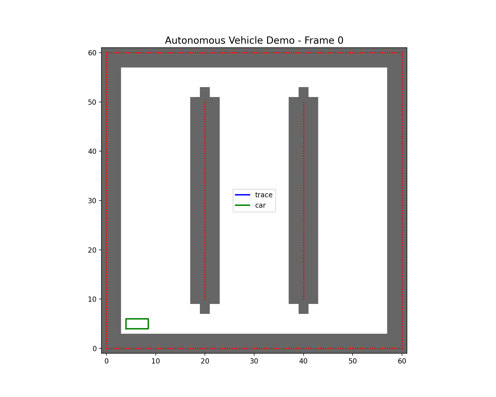
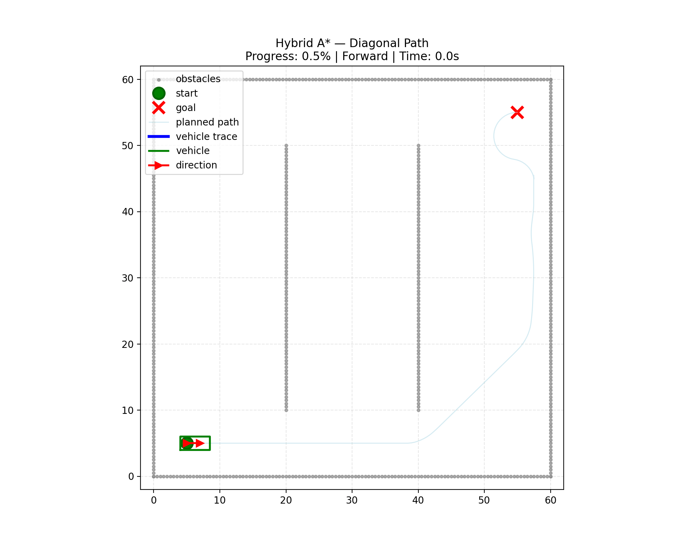
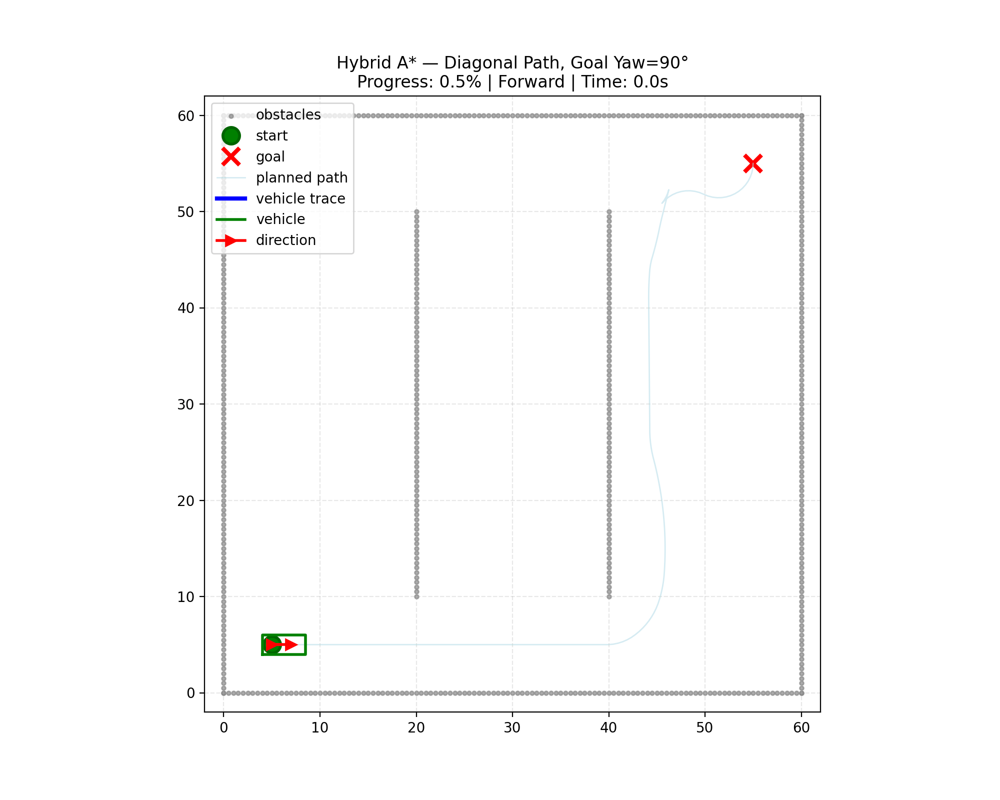
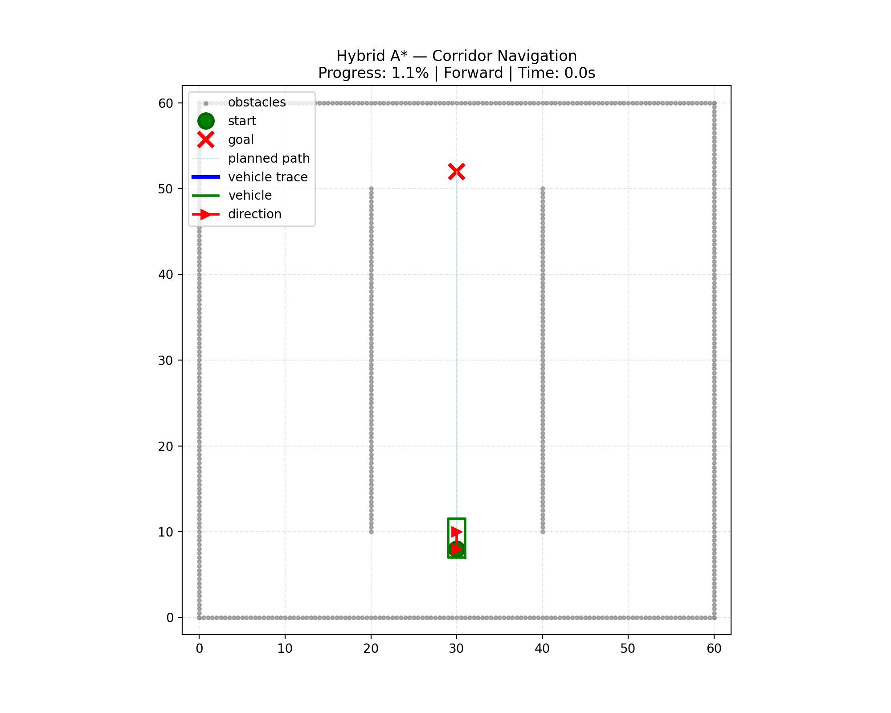

# Autonomous Vehicle 

This project is a learning project for an autonomous driving path planning system based on the **Hybrid A* Algorithm**. The original project was inspired by FredBill1's open-source implementation: https://github.com/FredBill1/AutonomousDrivingDemo.git

**Learning Background:**
- Initially participated as a group project, mainly responsible for the global planner part
- To deeply understand the algorithm principles and implementation details, I am now independently redoing the entire project
- Focus on learning the application of the Hybrid A* Algorithm in vehicle motion planning with non-holonomic constraints

## Core Algorithm

This project implements an autonomous driving path planning system based on the **Hybrid A* Algorithm**. The core idea of this algorithm is to use the evaluation function **f = g + h** to guide the search process:

- **g(n)**: The actual cost from the start to the current node n
  - Includes path length, steering angle changes, direction switches, and other motion costs
  - Ensures that the found path is kinematically feasible and has the minimum cost

- **h(n)**: The heuristic estimated cost from the current node n to the goal
  - Uses the Dijkstra distance field to provide acceptable heuristic information
  - Guides the search towards the goal direction, improving algorithm efficiency

- **f(n) = g(n) + h(n)**: Total Evaluation Function
  - Balances path quality and search efficiency
  - Prioritizes expanding nodes that are most promising to reach the goal

The algorithm generates candidate path segments through **Motion Primitives**, combined with **collision detection** and **cost evaluation**, to find the optimal path in continuous state space. This method is particularly suitable for handling vehicle motion planning problems with non-holonomic constraints.

The pseudo code is as follows：

```psudo code
# Preprocessing: Obtain the occupancy grid and Dijkstra distance field D
grid = obstacles.downsampling_to_grid(...)
D = _distance_field(grid, goal_xy)

# Initialize the start node (empty segment/zero segment)
start_sp = SimplePath(ijk=discretize(start), trajectory=np.array([[x0,y0,yaw0]]),
                      direction=0, steer=0.0)
start = Node(path=start_sp, cost=0.0, h_cost = H_COST * D[i0,j0], parent=None)
open = min_heap [start]
best_g = dictionary: key=(i,j,k) -> known minimum g

while open is not empty:
    cur = heappop(open)  # node with the smallest f

    if near the goal or can solve direct connection:
        # If direct connection is successful, wrap RSPath as Node for the last child, h=0
        backtrack parent chain to form the final path
        break

    # Expansion: try a batch of motion primitives (dir in {+1,-1} × steer in STEER_SET)
    for dir, steer in action set:
        # Use Car.update to roll continuously for a short distance (e.g., 3 meters), check for collisions every 0.5 meters within the segment
        traj, collided = rollout(cur.path.end_state, dir, steer, obstacles)
        if collided: continue

        child_sp = SimplePath(ijk=discretize(segment end), trajectory=traj, direction=dir, steer=steer)
        g2 = cur.cost + edge_cost(cur, child_sp)  # segment length + switch direction/steering angle/steering angle change penalty
        key = child_sp.ijk
        if key in best_g and g2 >= best_g[key]:  # prune inferior solutions
            continue

        h2 = H_COST * D[i,j]  # use the grid at the end of the segment for heuristic
        child = Node(path=child_sp, cost=g2, h_cost=h2, parent=cur)
        best_g[key] = g2
        heappush(open, child)
```

## Test-Demo

### Collision Detection Test

```bash
python -m demo.demo_test_collision
```
Tests vehicle collision detection system with animated car movement. Shows real-time collision checking as the car moves through an obstacle environment with visual feedback.




### Hybrid A* Path Planning

```bash
python -m demo.demo_hybridAstar_test
```
This is a complete demonstration of Hybrid A* path planning. It tests various scenarios, including diagonal navigation, goal orientation alignment, and corridor traversal, and visualizes the planned path results.

#### Scenario 1: Diagonal Path Planning

**Description:** The vehicle plans a diagonal path from the bottom left (5,5) to the top right (55,55). This demonstrates the Hybrid A* algorithm's pathfinding capability in a complex obstacle environment, where the vehicle needs to navigate around two vertical poles to reach the target position.

#### Scenario 2: Goal Orientation Alignment

**Description:** Tests the algorithm's ability to handle terminal constraints. The vehicle starts from (5,5,0°) and the target position is (55,55,90°), requiring both position and orientation alignment. The algorithm achieves precise goal orientation alignment through a combination of forward and reverse maneuvers.

#### Scenario 3: Corridor Navigation


**Description:** The vehicle navigates through a narrow corridor between two poles, from (30,8,90°) to (30,52,90°). This scenario tests the algorithm's path planning capability in constrained spaces, requiring precise vehicle control to avoid collisions.