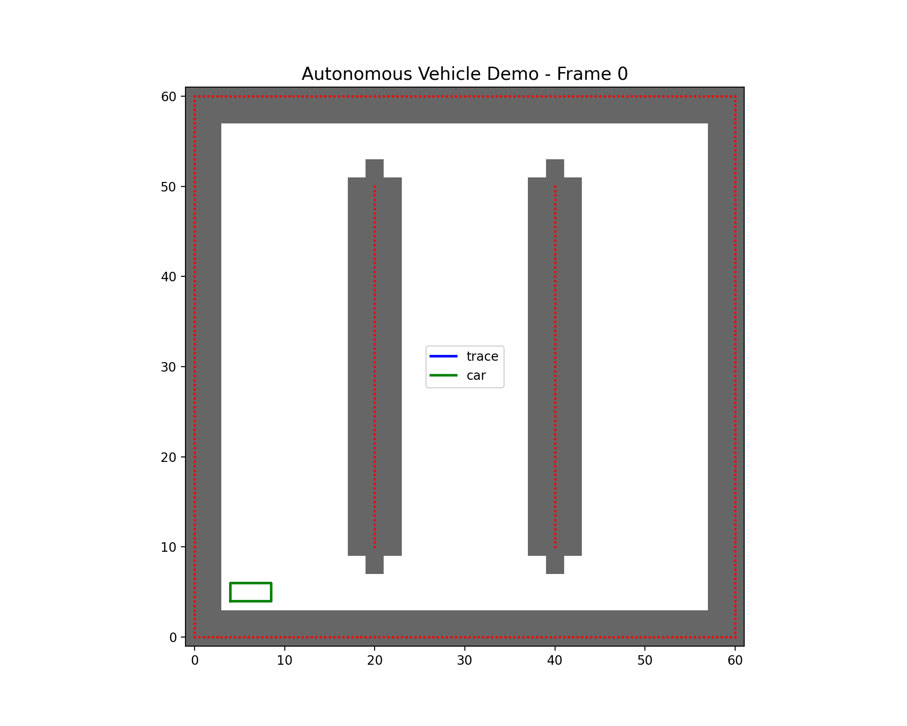

# Autonomous Vehicle 

This project is a learning project for an autonomous driving path planning system based on the **Hybrid A* Algorithm** and **MPC** local planning. Huge credit to FredBill1. The original implementation: https://github.com/FredBill1/AutonomousDrivingDemo.git

**Learning Background:**
- Initially participated as a group project, mainly responsible for the global planner part
- To deeply understand the algorithm principles and implementation details, I am now independently redoing the entire project
- Focus on learning the application of the Hybrid A* Algorithm in vehicle motion planning with non-holonomic constraints


**Project Overview:** Developed a comprehensive autonomous driving path planning system based on Hybrid A* Algorithm and Model Predictive Control (MPC), implementing a two-tier architecture with Global Planner and Local Planner

- Core Technologies:
   - Global Planner: Implemented Hybrid A* algorithm for vehicle motion planning with non-holonomic constraints
   - Local Planner: Real-time trajectory tracking control using MPC with kinematic bicycle model
   - Collision Detection: Real-time obstacle detection and avoidance algorithms
   - Visualization Interface: Real-time simulation interface built with PySide6 and PyQtGraph

**Tech Stack:** Python 3.12+, NumPy, SciPy, CVXPY, PySide6, OpenCV, Matplotlib, PyQtGraph

**Key Features:**
   - Implemented complete autonomous driving path planning algorithms supporting complex obstacle environments
   - Adopted hierarchical architecture design with global planner providing coarse paths and local planner for fine control
   - Supported multiple test scenarios: diagonal navigation, goal orientation alignment, narrow corridor traversal
   - Provided real-time visualization interface with vehicle state monitoring, trajectory display, and performance metrics

## Dependencies

Requires Python 3.12 or later.

```bash
pip install -r requirements.txt
```

## Launching

```bash
python -m AutonomousVehicle
```
launches the main app. 

If you encounter the following error on macOS:

```qt.qpa.plugin: Could not find the Qt platform plugin "cocoa" in "" This application failed to start because no Qt platform plugin could be initialized.```

This is a common issue with PySide6 on macOS in virtual environments. Follow these steps to fix it:

#### Method1 (Manual Fix) ####

1. **Install a compatible PySide6 version:**
   ```bash
   pip install PySide6==6.8.0
   ```

2. **Fix the Qt plugin rpath:**
   ```bash
   install_name_tool -add_rpath "$(pwd)/.venv/lib/python$(python -c 'import sys; print(sys.version_info.major, sys.version_info.minor, sep=".")')/site-packages/PySide6/Qt/lib" .venv/lib/python$(python -c 'import sys; print(sys.version_info.major, sys.version_info.minor, sep=".")')/site-packages/PySide6/Qt/plugins/platforms/libqcocoa.dylib
   ```

3. **Test the application:**
   ```bash
   python -m your_module_name
   ```

**Why this happens:** PySide6 6.9.x has known issues with macOS virtual environments. Using version 6.8.0 with proper rpath configuration resolves the plugin loading issue.
   

**Troubleshooting:**
- If you still get errors, try recreating your virtual environment
- Make sure you're running the commands from the project root directory
- For system-wide Python installations, you may need to use `sudo` with `install_name_tool`

#### Method2 (Recommended)####

Or you can launch the `start_app` script instead should automatically fix the issue: 

```bash
python start_app.py
```


## Core Algorithm

In autonomous driving systems, path planning is typically divided into two levels: **Global Planner** and **Local Planner**. These two levels work together, each with its own responsibilities, to achieve safe and efficient vehicle autonomous navigation.

- Global Planner (Hybrid A*) provides a "big road to follow"—a series of discrete $[x, y, \psi]$ points that can avoid obstacles but do not consider constraints like motor/tires/steering speed/acceleration or timing (such as how much to steer or accelerate every 70ms in a real car).

- Local Planner (MPC) checks the current position, orientation, and speed of the car at regular intervals (your LOCAL_PLANNER_DELTA_TIME); it then extracts a "reference segment" (prediction domain) from the global reference for the next few seconds, "tries" various future sequences of throttle and steering actions on paper, and selects the best plan (with the smallest error, smoothest actions, and within physical limits)—only executing the first action and recalculating in the next step. This is called receding horizon optimization.

### Global Planner
The path planning system is based on the **Hybrid A* Algorithm**. The core idea of this algorithm is to use the evaluation function **f = g + h** to guide the search process:

- **g(n)**: The actual cost from the start to the current node n
  - Includes path length, steering angle changes, direction switches, and other motion costs
  - Ensures that the found path is kinematically feasible and has the minimum cost

- **h(n)**: The heuristic estimated cost from the current node n to the goal
  - Uses the Dijkstra distance field to provide acceptable heuristic information
  - Guides the search towards the goal direction, improving algorithm efficiency

- **f(n) = g(n) + h(n)**: Total Evaluation Function
  - Balances path quality and search efficiency
  - Prioritizes expanding nodes that are most promising to reach the goal

The algorithm generates candidate path segments through **Motion Primitives**, combined with **collision detection** and **cost evaluation**, to find the optimal path in continuous state space. This method is particularly suitable for handling vehicle motion planning problems with non-holonomic constraints.

The pseudo code is as follows：

```psudo code
# Preprocessing: Obtain the occupancy grid and Dijkstra distance field D
grid = obstacles.downsampling_to_grid(...)
D = _distance_field(grid, goal_xy)

# Initialize the start node (empty segment/zero segment)
start_sp = SimplePath(ijk=discretize(start), trajectory=np.array([[x0,y0,yaw0]]),
                      direction=0, steer=0.0)
start = Node(path=start_sp, cost=0.0, h_cost = H_COST * D[i0,j0], parent=None)
open = min_heap [start]
best_g = dictionary: key=(i,j,k) -> known minimum g

while open is not empty:
    cur = heappop(open)  # node with the smallest f

    if near the goal or can solve direct connection:
        # If direct connection is successful, wrap RSPath as Node for the last child, h=0
        backtrack parent chain to form the final path
        break

    # Expansion: try a batch of motion primitives (dir in {+1,-1} × steer in STEER_SET)
    for dir, steer in action set:
        # Use Car.update to roll continuously for a short distance (e.g., 3 meters), check for collisions every 0.5 meters within the segment
        traj, collided = rollout(cur.path.end_state, dir, steer, obstacles)
        if collided: continue

        child_sp = SimplePath(ijk=discretize(segment end), trajectory=traj, direction=dir, steer=steer)
        g2 = cur.cost + edge_cost(cur, child_sp)  # segment length + switch direction/steering angle/steering angle change penalty
        key = child_sp.ijk
        if key in best_g and g2 >= best_g[key]:  # prune inferior solutions
            continue

        h2 = H_COST * D[i,j]  # use the grid at the end of the segment for heuristic
        child = Node(path=child_sp, cost=g2, h_cost=h2, parent=cur)
        best_g[key] = g2
        heappush(open, child)
```

### Local Planner (MPC)

**Model Predictive Control (MPC)** is an advanced control strategy used in the local planning of autonomous vehicles. It involves predicting the future behavior of the vehicle over a defined prediction horizon and optimizing the control inputs to achieve desired objectives. MPC takes into account the vehicle's dynamics, constraints, and a reference trajectory to minimize tracking errors and ensure smooth control actions. By solving an optimization problem at each time step, MPC provides a sequence of control actions that guide the vehicle along the optimal path while respecting physical and regulatory constraints.

#### Prediction Horizon
Choose a prediction length $N$ (e.g., 10 steps) and a step size $\Delta t$ (your `LOCAL_PLANNER_DELTA_TIME`). The Local Planner only focuses on the next $N$ steps at a time.

#### Vehicle Model (Kinematic Bicycle Model)
Given:
- $u_k = [a_k, \delta_k]$: throttle/brake (longitudinal acceleration $a_k$) and front wheel steering angle $\delta_k$
- $L$: wheelbase (`Car.WHEEL_BASE`)

The discretized kinematic model is:

$$
\begin{aligned}
X_{k+1} &= X_k + v_k \cos\psi_k\,\Delta t \\
Y_{k+1} &= Y_k + v_k \sin\psi_k\,\Delta t \\
v_{k+1} &= v_k + a_k\,\Delta t \\
\psi_{k+1} &= \psi_k + \frac{v_k}{L}\tan\delta_k\,\Delta t
\end{aligned}
$$

#### Scoring (Objective Function)
The goal is for the vehicle to follow the reference trajectory closely while maintaining smooth control actions:

$$
J=\sum_{k=0}^{N}\|x_k - x_k^{\mathrm{ref}}\|_Q^2 + \sum_{k=0}^{N-1}\|u_k - u_k^{\mathrm{ref}}\|_R^2 + \sum_{k=0}^{N-2}\|\Delta u_k\|_{R_\Delta}^2
$$

Where:
- The first term: tracking error in position/orientation/velocity (usually $Y$ and $\psi$ have higher weights)
- The second term: avoid sudden throttle or steering changes
- The third term: change in control between consecutive frames, ensuring smoothness (avoiding "jerky steering")

#### Hard Constraints (Physical/Regulatory)
1. Steering limit:
$$|\delta_k| \le \delta_{\max}\$$
2. Acceleration limit:
$$|a_k| \le a_{\max}\$$
3. Speed range:
$$0 \le v_k \le v_{\max}\$$
4. Lateral acceleration limit (critical!):
$$\Bigl|a_{y,k}\Bigr| = \left|\frac{v_k^{2}\tan\delta_k}{L}\right|
\le a_{y,\max}\ $$

Commonly used **speed-dependent steering angle limit**:

$$|\delta_k| \le \min\left( \delta_{\max}, \arctan\frac{a_{y,\max} L}{\max(v_k^{2}, \varepsilon)} \right)$$

> The faster you go, the smaller the allowable steering angle to prevent skidding.

#### Solution (QP + Iterative Linearization)
This is a **constrained Quadratic Programming (QP)** problem.

For linear solvability, **iterative linearization** is commonly used:
1. Use the current "nominal trajectory" $(\bar{x}_k, \bar{u}_k)$ (can be the last solution or a zero-control rollout)
2. Linearize the model at the nominal trajectory:
   $$x_{k+1} \approx A_k x_k + B_k u_k + C_k$$
3. Solve a QP (cost function + hard constraints)
4. Roll out the solution $U$ to update the nominal trajectory
5. Repeat 1–3 times (usually 1–3 iterations are sufficient)

Execution method:
- Execute only the first control $u_0$ obtained from this optimization
- Recalculate in the next step (rolling optimization)


## Test-Demo

### Collision Detection Test

```bash
python -m demo.test_collision
```
Tests vehicle collision detection system with animated car movement. Shows real-time collision checking as the car moves through an obstacle environment with visual feedback.




### Hybrid A* Path Planning

```bash
python -m demo.test_hybridAstar
```
This is a complete demonstration of Hybrid A* path planning. It tests various scenarios, including diagonal navigation, goal orientation alignment, and corridor traversal, and visualizes the planned path results.

#### Scenario 1: Diagonal Path Planning

**Description:** The vehicle plans a diagonal path from the bottom left (5,5) to the top right (55,55). This demonstrates the Hybrid A* algorithm's pathfinding capability in a complex obstacle environment, where the vehicle needs to navigate around two vertical poles to reach the target position.

#### Scenario 2: Goal Orientation Alignment

**Description:** Tests the algorithm's ability to handle terminal constraints. The vehicle starts from (5,5,0°) and the target position is (55,55,90°), requiring both position and orientation alignment. The algorithm achieves precise goal orientation alignment through a combination of forward and reverse maneuvers.

#### Scenario 3: Corridor Navigation


**Description:** The vehicle navigates through a narrow corridor between two poles, from (30,8,90°) to (30,52,90°). This scenario tests the algorithm's path planning capability in constrained spaces, requiring precise vehicle control to avoid collisions.