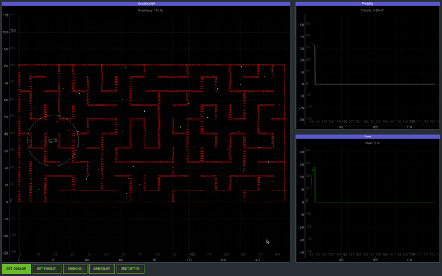
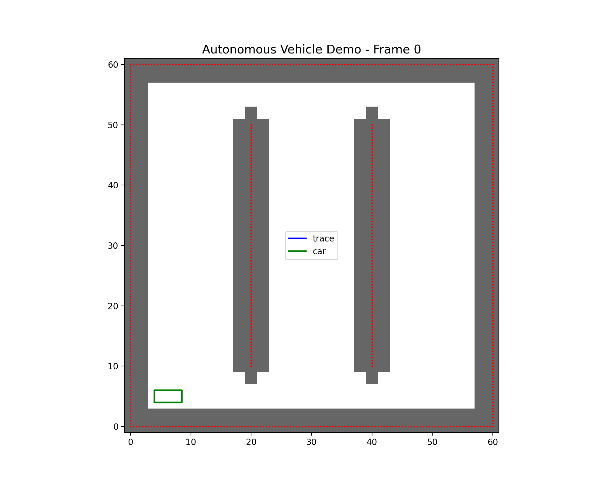
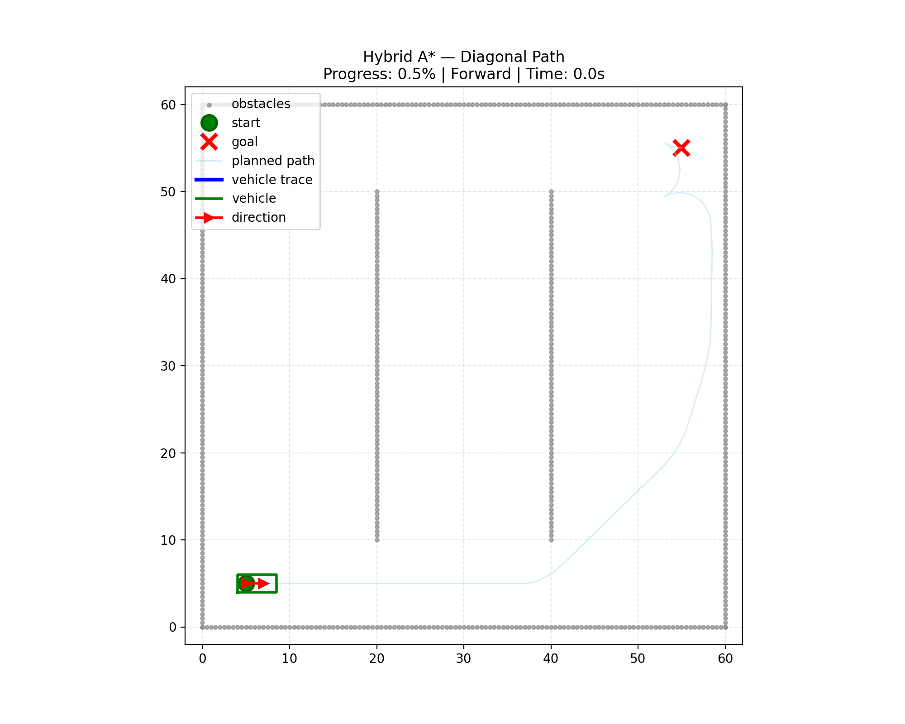
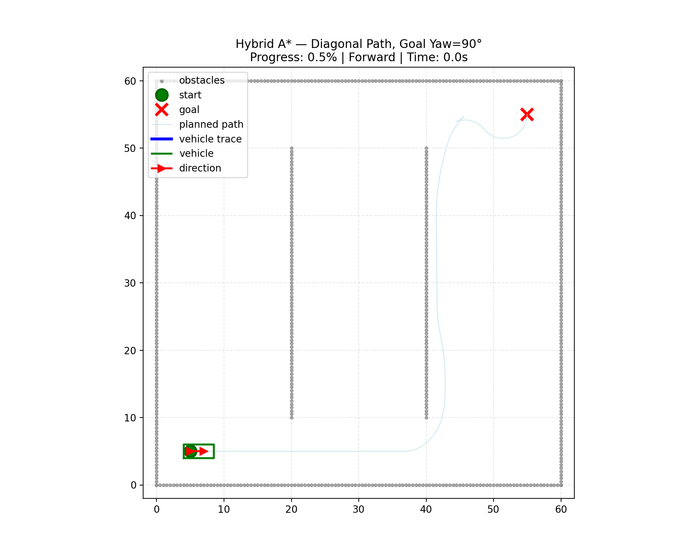
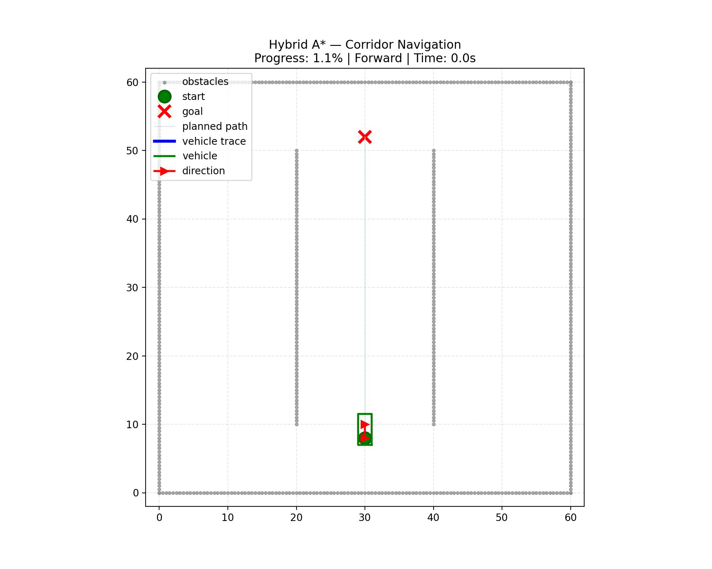

# Autonomous Vehicle 

This project is a learning project for an autonomous driving path planning system based on the **Hybrid A* Algorithm** and **MPC** local planning. Huge credit to FredBill1. The original implementation: https://github.com/FredBill1/AutonomousDrivingDemo.git

**Learning Background:**
- Initially participated as a group project, mainly responsible for the global planner part
- To deeply understand the algorithm principles and implementation details, I am now independently redoing the entire project
- Focus on learning the application of the Hybrid A* Algorithm in vehicle motion planning with non-holonomic constraints



**Project Overview:** Developed a comprehensive autonomous driving path planning system based on Hybrid A* Algorithm and Model Predictive Control (MPC), implementing a two-tier architecture with Global Planner and Local Planner

- Core Technologies:
   - Global Planner: Implemented Hybrid A* algorithm for vehicle motion planning with non-holonomic constraints
   - Local Planner: Real-time trajectory tracking control using MPC with kinematic bicycle model
   - Collision Detection: Real-time obstacle detection and avoidance algorithms
   - Visualization Interface: Real-time simulation interface built with PySide6 and PyQtGraph

**Tech Stack:** Python 3.12+, NumPy, SciPy, CVXPY, PySide6, OpenCV, Matplotlib, PyQtGraph

**Key Features:**
   - Implemented complete autonomous driving path planning algorithms supporting complex obstacle environments
   - Adopted hierarchical architecture design with global planner providing coarse paths and local planner for fine control
   - Supported multiple test scenarios: diagonal navigation, goal orientation alignment, narrow corridor traversal
   - Provided real-time visualization interface with vehicle state monitoring, trajectory display, and performance metrics

## Dependencies

Requires Python 3.12 or later.

```bash
pip install -r requirements.txt
```

## Launching

### 1. **Docker Backend** version: 

```bash
docker-compose up --build
```
validate with:

```bash
curl http://localhost:5000/api/vehicle/health
```

### 2. **Desktop-QT** version:

```bash
python -m AutonomousVehicle
```

launches the main app. 

If you encounter the following error on macOS:

```qt.qpa.plugin: Could not find the Qt platform plugin "cocoa" in "" This application failed to start because no Qt platform plugin could be initialized.```

This is a common issue with PySide6 on macOS in virtual environments. Follow these steps to fix it:

#### Method1 (Manual Fix) 

1. **Install a compatible PySide6 version:**
   ```bash
   pip install PySide6==6.8.0
   ```

2. **Fix the Qt plugin rpath:**
   ```bash
   install_name_tool -add_rpath "$(pwd)/.venv/lib/python$(python -c 'import sys; print(sys.version_info.major, sys.version_info.minor, sep=".")')/site-packages/PySide6/Qt/lib" .venv/lib/python$(python -c 'import sys; print(sys.version_info.major, sys.version_info.minor, sep=".")')/site-packages/PySide6/Qt/plugins/platforms/libqcocoa.dylib
   ```

3. **Test the application:**
   ```bash
   python -m your_module_name
   ```

**Why this happens:** PySide6 6.9.x has known issues with macOS virtual environments. Using version 6.8.0 with proper rpath configuration resolves the plugin loading issue.
   

**Troubleshooting:**
- If you still get errors, try recreating your virtual environment
- Make sure you're running the commands from the project root directory
- For system-wide Python installations, you may need to use `sudo` with `install_name_tool`

#### Method2 (Recommended)

Or you can launch the `start_app` script instead should automatically fix the issue: 

```bash
python start_app.py
```


## [Dev-log] Core Algorithm

In autonomous driving systems, path planning is typically divided into two levels: **Global Planner** and **Local Planner**. These two levels work together, each with its own responsibilities, to achieve safe and efficient vehicle autonomous navigation.

- Global Planner (Hybrid A*) provides a "big road to follow"—a series of discrete $[x, y, \psi]$ points that can avoid obstacles but do not consider constraints like motor/tires/steering speed/acceleration or timing (such as how much to steer or accelerate every 70ms in a real car).

- Local Planner (MPC) checks the current position, orientation, and speed of the car at regular intervals (your LOCAL_PLANNER_DELTA_TIME); it then extracts a "reference segment" (prediction domain) from the global reference for the next few seconds, "tries" various future sequences of throttle and steering actions on paper, and selects the best plan (with the smallest error, smoothest actions, and within physical limits)—only executing the first action and recalculating in the next step. This is called receding horizon optimization.

### Global Planner
The path planning system is based on the **Hybrid A* Algorithm**. The core idea of this algorithm is to use the evaluation function **f = g + h** to guide the search process:

- **g(n)**: The actual cost from the start to the current node n
  - Includes path length, steering angle changes, direction switches, and other motion costs
  - Ensures that the found path is kinematically feasible and has the minimum cost

- **h(n)**: The heuristic estimated cost from the current node n to the goal
  - Uses the Dijkstra distance field to provide acceptable heuristic information
  - Guides the search towards the goal direction, improving algorithm efficiency

- **f(n) = g(n) + h(n)**: Total Evaluation Function
  - Balances path quality and search efficiency
  - Prioritizes expanding nodes that are most promising to reach the goal

The algorithm generates candidate path segments through **Motion Primitives**, combined with **collision detection** and **cost evaluation**, to find the optimal path in continuous state space. This method is particularly suitable for handling vehicle motion planning problems with non-holonomic constraints.

---

### **Global Planner Implementation**

#### 0. **Constants and Action Space**

```python
XY_GRID_RESOLUTION = 1.0
YAW_GRID_RESOLUTION = deg2rad(15)
MOTION_DISTANCE = XY_GRID_RESOLUTION * 1.5 
MOTION_RESOLUTION    # simulation step size used in generate_neighbor()

NUM_STEER_COMMANDS = 10
STEER_COMMANDS = linspace(-Car.TARGET_MAX_STEER, +Car.TARGET_MAX_STEER, NUM_STEER_COMMANDS) + [0]
STEER_COMMANDS = unique(STEER_COMMANDS)

# 8-neighborhood moves for Dijkstra
MOVEMENTS = [(di,dj,cost) for di,dj in {-1,0,1}^2 except (0,0), cost=sqrt(di^2+dj^2)]

# Cost Weight
SWITCH_DIRECTION_COST
BACKWARDS_COST
STEER_CHANGE_COST
STEER_COST
H_DIST_COST
H_YAW_COST
H_COLLISION_COST
```

- SWITCH_DIRECTION_COST
    - g-cost; added when switching between forward and reverse (not applied to the initial node)
    - discourages frequent gear changes; reduces F-R-F "jitter" paths

- BACKWARDS_COST
    - g-cost; multiplies distance cost when moving backward
    - makes reverse more expensive, so forward is preferred if otherwise similar

- STEER_CHANGE_COST
    - g-cost; proportional to abs(steer - curr.path.steer)
    - penalizes sharp steering changes between segments; encourages a smooth steering profile

- STEER_COST
    - g-cost; proportional to abs(steer) * MOTION_DISTANCE
    - penalizes large steering angles; prefers straighter motion unless turning is necessary

- H_DIST_COST
    - h-cost; scales heuristic_grid.grid[i, j] (Dijkstra distance-to-go)
    - guides the search around obstacles and toward the goal efficiently

- H_YAW_COST
    - h-cost; multiplies heading error abs(wrap_angle(goal_yaw - yaw))
    - encourages arriving with correct final orientation (important for parking-like maneuvers)
- H_COLLISION_COST
    - heuristic "large number" used as initial/unreachable penalty in the Dijkstra grid
    - cells that are blocked/unreachable appear extremely distant, making A* avoid them

**For the purpose of Hybrid A*,**, we also need two lightweight data containers to (1) represent a locally simulated motion segment (the “edge” produced by one control action) and (2) represent a search node in the open list with enough information for DP pruning and traceback.

```python
class SimplePath(NamedTuple):
    ijk: tuple[int, int, int]
    trajectory: npt.NDArray[np.floating[Any]]
    direction: Literal[1, 0, -1]
    steer: float

class Node(NamedTuple):
    path: SimplePath | RSPath
    cost: float
    h_cost: float
    parent: Optional["Node"]

    def __lt__(self, other: "Node") -> bool:
        return (self.h_cost + self.cost, self.cost) < (other.h_cost + other.cost, other.cost)
```

- **SimplePath** (local segment / edge)
  - `ijk`: end-state discrete index for DP lookup (dp[i,j,k])
  - `trajectory`: the simulated continuous segment points
  - `direction`: +1 forward / -1 reverse / 0 initial
  - `steer`: steering angle used for this segment (used for steer change penalty)

- **Node** (search node / state in open list)
  - `path`: either a SimplePath segment or an RSPath final-connection segment
  - `cost`: g-cost accumulated from start to this node
  - `h_cost`: heuristic estimate to goal from this node
  - `parent`: backpointer for traceback_path
  - `__lt__`: heap ordering by f = g+h, tie-breaker by smaller g


#### 1. **heuristic: Dijkstra prediction of all grid to goal**

We need a fast-to-query heuristic `h_dist` that approximates **distance-to-go while respecting obstacles**.

We precompute a 2D grid `heuristic_grid.grid[i, j]` using Dijkstra on the downsampled obstacle grid, so later each Node can get `h_dist_cost = H_DIST_COST * heuristic_grid.grid[i, j]` in O(1).


``` python
def _distance_heuristic(grid: ObstacleGrid, goal_xy):
    H, W = grid.grid.shape
    dist = full(H,W, H_COLLISION_COST)      # 初始都很大
    ij = grid.calc_index(goal_xy)           # goal 在 grid 上的 (i,j)
    dist[ij] = 0
    pq = [(0, ij)]                          # heapq: (distance, (i,j))

    while pq not empty:
        d, (i,j) = heappop(pq)
        if d > dist[i,j]: continue          # 过期条目剪枝

        for (di,dj,cost) in MOVEMENTS:
            ni,nj = i+di, j+dj
            n_cost = d + cost
            if inside(ni,nj) AND not grid.grid[ni,nj] (非障碍) AND n_cost < dist[ni,nj]:
                dist[ni,nj] = n_cost
                heappush(pq, (n_cost, (ni,nj)))

    return ObstacleGrid(..., dist)  # dist 当作新的 grid.grid
```

-  **ObstacleGrid (for heuristic)**
   - `grid.grid[i, j]`: boolean occupancy (True = blocked, False = free)
   - `grid.calc_index([x, y])`: maps continuous (x, y) → discrete (i, j)
- **dist / heuristic_grid.grid**
   - `dist[i, j]`: best-known Dijkstra distance from (i, j) to goal_ij
   - Initialized with `H_COLLISION_COST` (inf)
- **MOVEMENTS (8-neighborhood)**
   - Each move is (di, dj, step_cost)
   - Includes diagonals, with `step_cost = sqrt(di^2 + dj^2)` 
- **Blocked cell handling**
   - Condition not `grid.grid[ni, nj]` prevents entering obstacles
   - Blocked/unreachable remain near `H_COLLISION_COST`
   - **Effect on A***:  
      - `h_dist_cost = H_DIST_COST * heuristic_grid.grid[i, j]` becomes huge ⇒ those states are strongly deprioritized
- **How Hybrid A* consumes it**
   - After simulating a neighbor and discretizing to (i, j, k):
      - `h_dist_cost = H_DIST_COST * heuristic_grid.grid[i, j]`
      - Plus yaw term:  
         - `h_yaw_cost = H_YAW_COST * abs(wrap_angle(goal_yaw - yaw))`
      - `h_cost = h_dist_cost + h_yaw_cost`

#### 2. **state discretization + DP table (calc_ijk + dp pruning)**


We need a consistent way to **deduplicate states** during A* search.
Because the car state is continuous `(x, y, yaw)`, we discretize it into `(i, j, k)` so we can index a 3D DP table `dp[i, j, k]` and store the best-known `Node` for that discretized state.

We use:

```python
K = int(2*pi / YAW_GRID_RESOLUTION)
dp = full((N,M,K), None)     

def calc_ijk(x,y,yaw):
    i,j = heuristic_grid.calc_index([x,y])
    yaw0 = wrap_angle(yaw, zero_to_2pi=True)
    k = int(yaw0 // YAW_GRID_RESOLUTION)
    return (i,j,k)

```

- **(i, j) from heuristic_grid**
  - `heuristic_grid.calc_index([x, y])` maps continuous `(x, y)` → discrete grid indices.
  - Using the same grid as Dijkstra makes `h_dist_cost = H_DIST_COST * heuristic_grid.grid[i, j]` directly usable.
- **k (yaw bin)**
  - `wrap_angle(yaw, zero_to_2pi=True)` normalizes yaw into `[0, 2π)`.
  - `k = int(yaw // YAW_GRID_RESOLUTION)` bins yaw into discrete buckets.
  - **Effect:** DP treats “same cell + same yaw bucket” as the same state.
- **dp[i, j, k] stores Node (best-known arrival)**
  - Each dp entry stores the `Node` with the smallest `cost` (g-cost) found so far for that `(i, j, k)`.
  - If a newly generated node is not better, it is discarded (pruned).
- **DP pruning rule (how it is used in the main loop)**
  - When popping from heap:
    - If `curr.cost > dp[curr.path.ijk].cost`, then `curr` is an outdated heap entry ⇒ skip.
  - When pushing neighbors:
    - If `dp[ijk] is None` or `neighbor.cost < dp[ijk].cost`, update dp and push into heap.
  - **Effect on A***: dramatically reduces redundant expansions and keeps search tractable.
- **Boundary note**
  - `calc_ijk()` itself does not guarantee `(i, j)` is inside `[0..N), [0..M)`.
  - Usually the boundary check happens after simulating motion (e.g., in `generate_neighbor`) before accepting a neighbor.

#### 3. **local expansion: generate_neighbor (simulate motion + collision + g/h cost)**

We need a way to expand a `Node` into dynamically-feasible neighbors.  
Instead of “grid-adjacent” moves, Hybrid A* generates each neighbor by **simulating the car** forward/backward for `MOTION_DISTANCE` with a chosen steering command.

Each successful simulation becomes a `SimplePath` segment and a new `Node` carrying:
- `cost` (g-cost): accumulated from start
- `h_cost` (h-cost): heuristic distance + heading error

```python
def generate_neighbor(curr: Node, direction: int, steer: float) -> Optional[Node]:
    # start pose = end pose of current segment
    x0, y0, yaw0 = curr.path.trajectory[-1, :3]

    # simulate car using the chosen control (direction, steer)
    car = Car(x0, y0, yaw0, velocity=direction, steer=steer)
    trajectory = []

    # integrate motion for a fixed arc length
    for step in range(int(MOTION_DISTANCE / MOTION_RESOLUTION)):
        car.update(MOTION_RESOLUTION)

        # collision check along the segment
        if (not start_collided) and car.check_collision(obstacles):
            return None

        trajectory.append([car.x, car.y, car.yaw])

    # discretize end pose into dp index
    i, j, k = calc_ijk(car.x, car.y, car.yaw)
    if not inside_grid(i, j, N, M):
        return None

    # g-cost (true accumulated cost)
    distance_cost = MOTION_DISTANCE if direction == +1 else MOTION_DISTANCE * BACKWARDS_COST
    switch_direction_cost = SWITCH_DIRECTION_COST if (curr.path.direction != 0 and direction != curr.path.direction) else 0
    steer_change_cost = STEER_CHANGE_COST * abs(steer - curr.path.steer)
    steer_cost = STEER_COST * abs(steer) * MOTION_DISTANCE
    new_cost = curr.cost + distance_cost + switch_direction_cost + steer_change_cost + steer_cost

    # h-cost (heuristic)
    h_dist_cost = H_DIST_COST * heuristic_grid.grid[i, j]
    h_yaw_cost  = H_YAW_COST  * abs(wrap_angle(goal_yaw - car.yaw))
    new_h_cost  = h_dist_cost + h_yaw_cost

    # package neighbor node
    new_path = SimplePath(ijk=(i, j, k), trajectory=array(trajectory), direction=direction, steer=steer)
    return Node(path=new_path, cost=new_cost, h_cost=new_h_cost, parent=curr)
```

- **Why we simulate (instead of grid moves)**
  - The car has nonholonomic constraints; many “adjacent cells” are not reachable with feasible curvature.
  - Simulation ensures each neighbor segment is physically plausible under `(direction, steer)`.

- **Start pose source**
  - `curr.path.trajectory[-1, :3]` is the current end pose.
  - **Effect:** the search state is continuous; discretization is only for DP indexing.

- **Segment length and resolution**
  - `MOTION_DISTANCE`: total arc length for one expansion step.
  - `MOTION_RESOLUTION`: integration step size inside that segment.
  - **Effect:** smaller `MOTION_RESOLUTION` improves collision accuracy but costs more compute.

- **Collision checking along the segment**
  - Check collision at each integration step (not just at the end).
  - **Effect:** prevents “tunneling” through obstacles between sparse samples.

- **Discretization of the end pose**
  - `calc_ijk(car.x, car.y, car.yaw)` produces `(i, j, k)` for `dp[i, j, k]`.
  - Boundary checks are done here; out-of-grid neighbors are rejected.

- **g-cost components (accumulate into `new_cost`)**
  - `distance_cost`: forward cost vs backward cost (`BACKWARDS_COST`).
  - `switch_direction_cost`: penalize gear changes (`SWITCH_DIRECTION_COST`).
  - `steer_change_cost`: penalize sudden steer changes (`STEER_CHANGE_COST`).
  - `steer_cost`: penalize large steering magnitude (`STEER_COST`).

- **h-cost components (store into `new_h_cost`)**
  - `h_dist_cost`: obstacle-aware distance-to-go from Dijkstra (`H_DIST_COST * heuristic_grid.grid[i, j]`).
  - `h_yaw_cost`: heading alignment toward `goal_yaw` (`H_YAW_COST * abs(wrap_angle(goal_yaw - yaw))`).
  - `new_h_cost = h_dist_cost + h_yaw_cost`.


#### 4. **local expansion: generate_neighbors (enumerate action space)**

We need to generate **all candidate neighbors** of the current `Node` by enumerating the discrete action space:  
`direction ∈ {+1, -1}` (forward/reverse) × `steer ∈ STEER_COMMANDS`.

`generate_neighbors(curr)` is a thin wrapper that repeatedly calls `generate_neighbor(curr, direction, steer)` and yields only feasible results (non-colliding, in-bounds).

```python
def generate_neighbors(curr: Node) -> Generator[Node, None, None]:
    nonlocal start_collided

    for direction in [+1, -1]:
        for steer in STEER_COMMANDS:
            node = generate_neighbor(curr, direction, steer)
            if node is not None:
                yield node

    # start-collision special-case is only allowed once;
    # after the first expansion from the start, turn it off
    start_collided = False
```

- **Action space definition**
  - `direction`: `+1` forward, `-1` reverse.
  - `STEER_COMMANDS`: discretized steering angles in `[-Car.TARGET_MAX_STEER, +Car.TARGET_MAX_STEER]` plus `0`.

- **Filtering invalid actions**
  - `generate_neighbor` returns `None` if the simulated segment collides or goes out of bounds.
  - `generate_neighbors` yields only valid `Node` objects.

- **Why yield (Generator)**
  - Neighbors are produced lazily; the caller can process them one-by-one without allocating a full list.
  - This reduces memory pressure when many expansions happen.

- **start_collided handling**
  - `start_collided` is a special flag allowing a start pose that is initially in collision.
  - After the first expansion attempt, `start_collided = False` so later expansions enforce normal collision rules.


#### 5. **main A* loop (dp pruning + priority queue expansion)**

We need a global search loop that repeatedly expands the most promising `Node` (lowest `f = g + h`) until a solution is found or the open list is exhausted.

We use:
- `q` (a `heapq`) as the open list, ordered by `Node.__lt__` (primary: `g+h`, tie-break: smaller `g`)
- `dp[i, j, k]` to store the best-known `Node` for each discretized state and prune outdated/expensive states

```python
# initialization (start node already constructed)
dp[start_ijk] = start_node
q = [start_node]  # heapq open list

while q:
    curr = heapq.heappop(q)  # pop min f = g+h

    # outdated entry pruning:
    # heap may contain older versions of the same (i,j,k) state
    if curr.cost > dp[curr.path.ijk].cost:
        continue

    # optional early-cancel hook (UI / websocket / user stop)
    if cancel_callback is not None and cancel_callback(curr):
        return None

    # expand neighbors using motion primitives
    for neighbor in generate_neighbors(curr):
        ijk = neighbor.path.ijk

        # DP relaxation: keep only cheaper g-cost for each discretized state
        if dp[ijk] is None or neighbor.cost < dp[ijk].cost:
            dp[ijk] = neighbor
            heapq.heappush(q, neighbor)

# if open list exhausted, no feasible path found
return None
```

- **Why we still need dp even with A***
  - The same discretized state `(i, j, k)` can be reached via many different motion sequences.
  - `dp[i, j, k]` stores the best-known (lowest g-cost) arrival and prunes worse duplicates.

- **Outdated entry pruning**
  - Even after `dp[ijk]` is improved, older nodes for the same `ijk` may still remain in the heap.
  - Condition `curr.cost > dp[curr.path.ijk].cost` skips those stale heap entries.

- **DP relaxation rule**
  - Only accept `neighbor` if it improves the best-known g-cost for its `ijk`.
  - If accepted: update `dp[ijk]` and push into `q`.

- **Connection to your earlier components**
  - `generate_neighbors(curr)` provides feasible motion segments (already collision-checked).
  - `neighbor.path.ijk` is the discretized key used for dp pruning.
  - `neighbor.cost` is accumulated g-cost; `neighbor.h_cost` is computed inside `generate_neighbor`.

#### 6. **goal connection: Reeds–Shepp shortcut (generate_rspath near the goal)**

We need a reliable way to finish the plan once the search gets close to the goal.  
Instead of continuing many small motion-primitive expansions, Hybrid A* tries an analytic connection using **Reeds–Shepp (RS)** from the current pose to the goal pose.

When `||curr_xy - goal_xy|| <= REEDS_SHEPP_MAX_DISTANCE`, we attempt:
- generate candidate `RSPath` solutions
- collision-check them
- compute the RS segment cost
- wrap the best RS segment into a `Node(path=RSPath, parent=curr)`
- either return immediately (fast) or push it into the heap

```python
# constants (typical pattern)
REEDS_SHEPP_MAX_DISTANCE = ...         # try RS when close enough to goal
RETURN_RS_PATH_IMMEDIATELY = ...       # if True: return once RS succeeds

def generate_rspath(curr: Node) -> Optional[Node]:
    start_pose = tuple(curr.path.trajectory[-1, :3])   # (x, y, yaw)
    goal_pose  = tuple(goal)                           # (x, y, yaw)

    # 1) generate RS candidates (analytic paths that allow forward+reverse)
    paths = solve_rspath(
        start_pose,
        goal_pose,
        Car.TARGET_MIN_TURNING_RADIUS,
        MOTION_RESOLUTION,
    )

    # 2) filter by collision + feasibility (library-dependent)
    paths = filter(check_rspath_collision, paths)

    # 3) compute RS segment cost and pick the best one
    best_path, best_cost = argmin_over_paths(paths, key=calc_rspath_cost)
    if best_path is None:
        return None

    # 4) wrap into a Node; heuristic can be 0 because RS reaches the goal
    rs_node = Node(path=best_path, cost=curr.cost + best_cost, h_cost=0.0, parent=curr)
    return rs_node

# integration into main loop (inside while q:)
if distance(curr_xy, goal_xy) <= REEDS_SHEPP_MAX_DISTANCE:
    rsnode = generate_rspath(curr)
    if rsnode is not None:
        if RETURN_RS_PATH_IMMEDIATELY:
            return traceback_path(rsnode)
        else:
            heapq.heappush(q, rsnode)
```

- **Why we need RS near the goal**
  - Small motion primitives may take many expansions to precisely match the goal pose (especially yaw).
  - RS provides an analytic “direct connection” that can finish efficiently.

- **When we attempt RS**
  - Condition: `np.linalg.norm(curr_xy - goal_xy) <= REEDS_SHEPP_MAX_DISTANCE`.
  - **Effect:** only try RS in a local region to keep computation reasonable.

- **What RSPath represents**
  - An analytic path that respects a minimum turning radius and allows forward/reverse.
  - Typically already includes direction for each waypoint (`driving_direction`).

- **Collision checking is mandatory**
  - RS solutions are geometric; without `check_rspath_collision`, they may cut through obstacles.
  - Only collision-free RS candidates are allowed.

- **RS segment cost**
  - Usually includes distance (forward/reverse), direction switches, and steering-related penalties (implementation-dependent).
  - The chosen RS candidate is the one with smallest added cost from `curr`.

- **Why `h_cost = 0.0` for RS node**
  - The RS segment is intended to reach the goal pose directly.
  - After adding the RS node, the remaining heuristic is effectively zero.

- **Two policies after RS success**
  - `RETURN_RS_PATH_IMMEDIATELY = True`: fastest; stop search and reconstruct.
  - Otherwise: push RS node into heap and let A* decide (more optimal but slower).


#### 7. **traceback: reconstruct final trajectory (traceback_path + cleanup)**

We need to convert the linked `Node` chain (via `parent`) into a single final trajectory.  
Each `Node` stores only a local segment (`SimplePath` or `RSPath`), so we traceback from the goal node to the start node, collect all segments, reverse them, and `vstack` into one continuous array.

We also normalize the output format to `[[x, y, yaw, direction], ...]` and perform a small cleanup to remove “jitter” points around consecutive direction switches.

```python
def traceback_path(node: Node) -> NDArray:
    segments = []

    # collect segments from goal -> start
    while node is not None:
        path = node.path

        if isinstance(path, SimplePath):
            # SimplePath trajectory can be Nx3 or Nx4
            if traj_has_4_cols(path.trajectory):
                segments.append(path.trajectory)
            else:
                # append direction column using path.direction
                segments.append(hstack_xyz_and_direction(path.trajectory, path.direction))

        else:  # RSPath
            # RSPath includes the start point, skip it to avoid duplicate joints
            seg = [[p.x, p.y, p.yaw, p.driving_direction] for p in islice(path.waypoints(), 1, None)]
            if seg is not empty:
                segments.append(seg)

        node = node.parent

    # reverse to start -> goal, then stitch
    segments.reverse()
    trajectory = vstack(segments)  # shape (T, 4)

    # fix initial direction (avoid 0 / undefined at index 0)
    d = trajectory[:, 3]
    d[0] = d[1] if len(d) > 1 else 1

    # cleanup: remove consecutive direction-changing points (F-R-F or R-F-R)
    switch = (d[t] != d[t+1]) for t in [0..T-2]
    remove_mid = switch[t] AND switch[t+1]          # consecutive switches
    keep_mask = [True] + [not remove_mid] + [True]
    trajectory = trajectory[keep_mask]

    return trajectory
```

- **Why we need traceback_path**
  - A* stores a `parent` pointer instead of storing the full path for every node.
  - `traceback_path(goal_node)` reconstructs the chosen route by following `parent` links.

- **What is being stitched**
  - Each `Node.path` is a local segment:
    - `SimplePath`: simulated motion primitive segment
    - `RSPath`: final analytic connection segment near the goal
  - The final trajectory is the concatenation of all segments in order.

- **Why we reverse segments**
  - The `parent` chain goes from goal → start.
  - Reversing `segments` restores chronological order: start → goal.

- **Why RSPath skips its first waypoint**
  - RSPath often includes its start pose as the first waypoint.
  - If we also include the last pose of the previous segment, the joint point duplicates.
  - `islice(..., 1, None)` avoids repeating that shared point.

- **Output normalization (Nx4)**
  - `SimplePath.trajectory` may be `Nx3`; direction is stored separately in `SimplePath.direction`.
  - Traceback ensures output is always `[[x, y, yaw, direction], ...]`.

- **Cleanup: remove consecutive direction-switch points**
  - If direction changes twice in a row (`+1 -> -1 -> +1` or `-1 -> +1 -> -1`), the middle point causes jitter.
  - The mask removes the middle point of these “double-switch” patterns to smooth the final trajectory.


---

### Local Planner (MPC)

**Model Predictive Control (MPC)** is an advanced control strategy used in the local planning of autonomous vehicles. It involves predicting the future behavior of the vehicle over a defined prediction horizon and optimizing the control inputs to achieve desired objectives. MPC takes into account the vehicle's dynamics, constraints, and a reference trajectory to minimize tracking errors and ensure smooth control actions. By solving an optimization problem at each time step, MPC provides a sequence of control actions that guide the vehicle along the optimal path while respecting physical and regulatory constraints.

#### Prediction Horizon
Choose a prediction length $N$ (e.g., 10 steps) and a step size $\Delta t$ (your `LOCAL_PLANNER_DELTA_TIME`). The Local Planner only focuses on the next $N$ steps at a time.

#### Vehicle Model (Kinematic Bicycle Model)
Given:
- $u_k = [a_k, \delta_k]$: throttle/brake (longitudinal acceleration $a_k$) and front wheel steering angle $\delta_k$
- $L$: wheelbase (`Car.WHEEL_BASE`)

The discretized kinematic model is:

$$
\begin{aligned}
X_{k+1} &= X_k + v_k \cos\psi_k\,\Delta t \\
Y_{k+1} &= Y_k + v_k \sin\psi_k\,\Delta t \\
v_{k+1} &= v_k + a_k\,\Delta t \\
\psi_{k+1} &= \psi_k + \frac{v_k}{L}\tan\delta_k\,\Delta t
\end{aligned}
$$

#### Scoring (Objective Function)
The goal is for the vehicle to follow the reference trajectory closely while maintaining smooth control actions:

$$
J=\sum_{k=0}^{N}\|x_k - x_k^{\mathrm{ref}}\|_Q^2 + \sum_{k=0}^{N-1}\|u_k - u_k^{\mathrm{ref}}\|_R^2 + \sum_{k=0}^{N-2}\|\Delta u_k\|_{R_\Delta}^2
$$

Where:
- The first term: tracking error in position/orientation/velocity (usually $Y$ and $\psi$ have higher weights)
- The second term: avoid sudden throttle or steering changes
- The third term: change in control between consecutive frames, ensuring smoothness (avoiding "jerky steering")

#### Hard Constraints (Physical/Regulatory)
1. Steering limit:
$$|\delta_k| \le \delta_{\max}\$$
2. Acceleration limit:
$$|a_k| \le a_{\max}\$$
3. Speed range:
$$0 \le v_k \le v_{\max}\$$
4. Lateral acceleration limit (critical!):
$$\Bigl|a_{y,k}\Bigr| = \left|\frac{v_k^{2}\tan\delta_k}{L}\right|
\le a_{y,\max}\ $$

Commonly used **speed-dependent steering angle limit**:

$$|\delta_k| \le \min\left( \delta_{\max}, \arctan\frac{a_{y,\max} L}{\max(v_k^{2}, \varepsilon)} \right)$$

> The faster you go, the smaller the allowable steering angle to prevent skidding.

#### Solution (QP + Iterative Linearization)
This is a **constrained Quadratic Programming (QP)** problem.

For linear solvability, **iterative linearization** is commonly used:
1. Use the current "nominal trajectory" $(\bar{x}_k, \bar{u}_k)$ (can be the last solution or a zero-control rollout)
2. Linearize the model at the nominal trajectory:
   $$x_{k+1} \approx A_k x_k + B_k u_k + C_k$$
3. Solve a QP (cost function + hard constraints)
4. Roll out the solution $U$ to update the nominal trajectory
5. Repeat 1–3 times (usually 1–3 iterations are sufficient)

Execution method:
- Execute only the first control $u_0$ obtained from this optimization
- Recalculate in the next step (rolling optimization)


## Test-Demo

### Collision Detection Test

```bash
python -m demo.test_collision
```
Tests vehicle collision detection system with animated car movement. Shows real-time collision checking as the car moves through an obstacle environment with visual feedback.




### Hybrid A* Path Planning

```bash
python -m demo.test_hybridAstar
```
This is a complete demonstration of Hybrid A* path planning. It tests various scenarios, including diagonal navigation, goal orientation alignment, and corridor traversal, and visualizes the planned path results.

#### Scenario 1: Diagonal Path Planning

**Description:** The vehicle plans a diagonal path from the bottom left (5,5) to the top right (55,55). This demonstrates the Hybrid A* algorithm's pathfinding capability in a complex obstacle environment, where the vehicle needs to navigate around two vertical poles to reach the target position.

#### Scenario 2: Goal Orientation Alignment

**Description:** Tests the algorithm's ability to handle terminal constraints. The vehicle starts from (5,5,0°) and the target position is (55,55,90°), requiring both position and orientation alignment. The algorithm achieves precise goal orientation alignment through a combination of forward and reverse maneuvers.

#### Scenario 3: Corridor Navigation


**Description:** The vehicle navigates through a narrow corridor between two poles, from (30,8,90°) to (30,52,90°). This scenario tests the algorithm's path planning capability in constrained spaces, requiring precise vehicle control to avoid collisions.